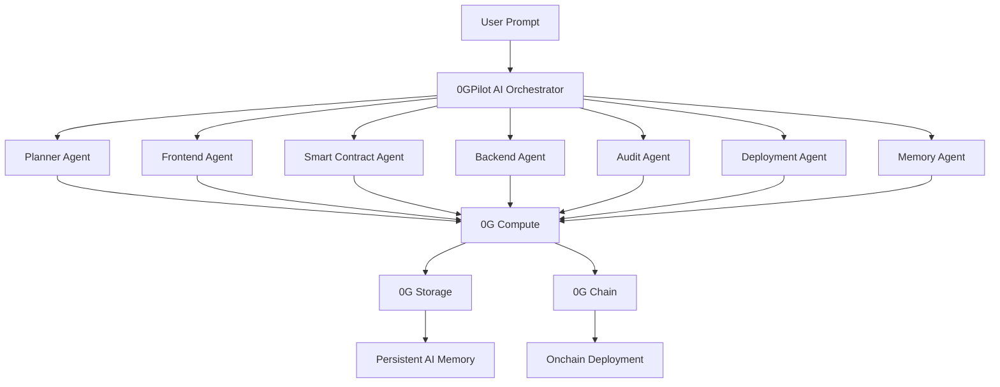
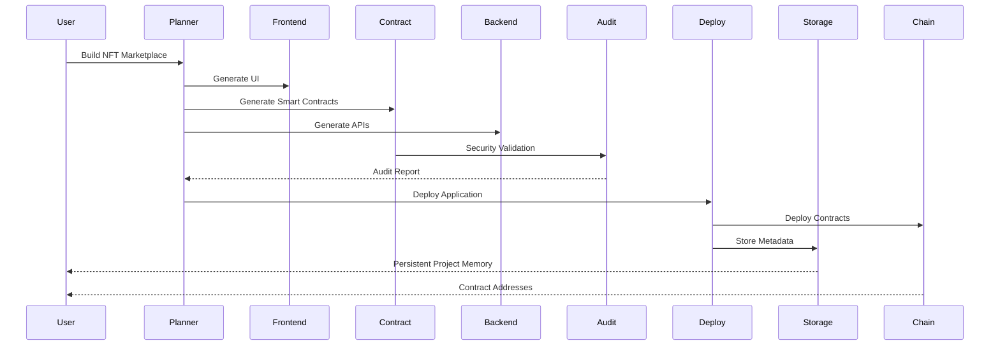
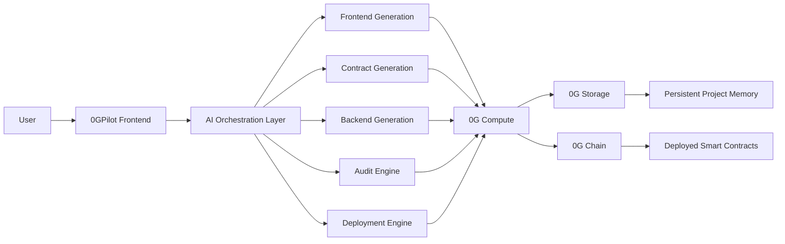
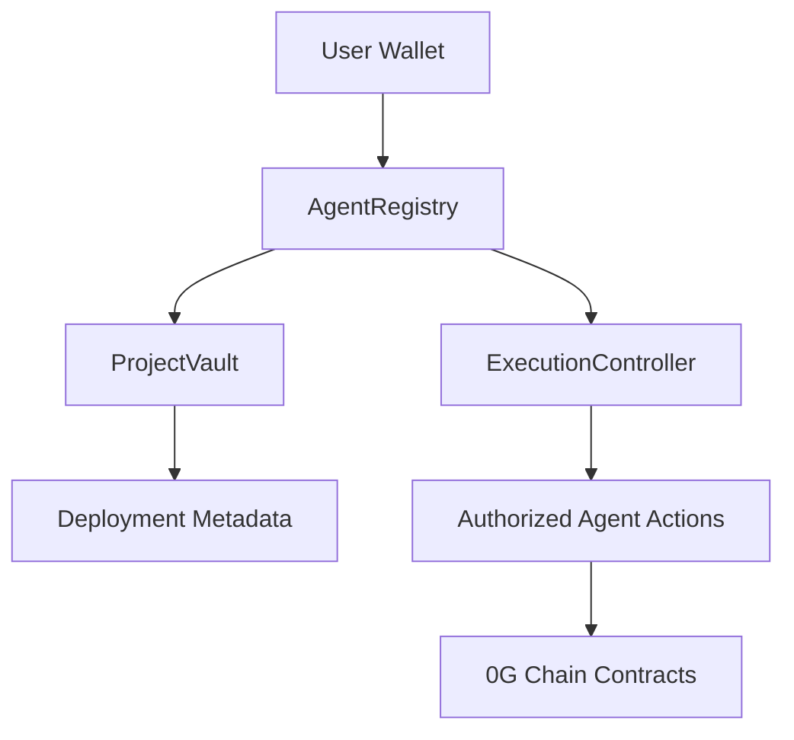

## Autonomous AI Software Engineer for Web3 Built on 0G

0GPilot is an AI-native autonomous Web3 software engineering platform built on the 0G ecosystem.

The platform enables users to generate, audit, deploy, and manage decentralized applications using natural language prompts.

Using 0G Compute, 0G Storage, 0G Chain, OpenClaw, and Agent ID, 0GPilot transforms Web3 development into an autonomous AI-driven workflow capable of generating frontend applications, smart contracts, backend APIs, deployment pipelines, and persistent decentralized project memory.

---

# Problem Statement

Building decentralized applications remains highly fragmented and technically complex.

Developers currently need to:

- Write secure smart contracts
- Build frontend interfaces
- Configure backend infrastructure
- Integrate wallets and protocols
- Deploy applications manually
- Manage DevOps pipelines
- Maintain project state and context

Existing AI coding assistants only generate isolated code snippets and lack:

- Persistent decentralized memory
- Autonomous orchestration
- Blockchain-native deployment
- Multi-agent collaboration
- Verifiable execution

This creates a major barrier for:

- Solo developers
- Startups
- Web3 builders
- AI-native applications

---

# Solution

0GPilot introduces autonomous AI software engineering for Web3.

Users can describe an application idea such as:

> "Build an NFT marketplace with royalties and wallet integration."

The platform autonomously:

- Plans architecture
- Generates frontend UI
- Creates smart contracts
- Builds backend APIs
- Configures deployment pipelines
- Performs AI-powered auditing
- Deploys contracts on 0G Chain
- Stores persistent memory using 0G Storage

---

# Screenshots


# Key Features

## AI DApp Generation

Generate complete decentralized applications using conversational prompts.

## Smart Contract Generation

Generate production-ready Solidity smart contracts with testing and security analysis.

## Multi-Agent Architecture

Specialized autonomous agents coordinate software engineering workflows.

## Persistent AI Memory

Store long-term project memory using 0G Storage.

## Autonomous Deployment

Deploy frontend and smart contracts directly to 0G infrastructure.

## AI Security Auditor

Detect vulnerabilities and optimize contracts automatically.

## Agentic Web3 Infrastructure

Designed for OpenClaw-compatible autonomous orchestration workflows using LangGraph-based agent coordination.

---

# 0G Integration

| 0G Module  | Usage                                |
| ---------- | ------------------------------------ |
| 0G Compute | AI inference and orchestration       |
| 0G Storage | Persistent memory and project states |
| 0G Chain   | Smart contract deployment            |
| OpenClaw   | Compatible orchestration target      |
| Agent ID   | Persistent agent identity            |

---

# System Architecture



---

# Multi-Agent Workflow



---

# Technical Approach

0GPilot follows a modular agentic architecture optimized for decentralized AI execution.

## Step 1 — Requirement Analysis

The Planner Agent interprets user prompts and generates application architecture.

## Step 2 — Component Generation

Specialized agents independently generate:

- Frontend code
- Backend services
- Solidity contracts
- Deployment scripts

## Step 3 — AI Security Analysis

The Audit Agent scans contracts for:

- Reentrancy
- Access control issues
- Unsafe patterns
- Gas inefficiencies

## Step 4 — Deployment

The Deployment Agent deploys contracts to 0G Chain and configures infrastructure.

## Step 5 — Persistent Memory Storage

All project metadata, architecture decisions, deployment states, and prompts are stored in 0G Storage.

---

# High-Level Infrastructure Flow



---

# Smart Contract Architecture



---

# Tech Stack

| Layer              | Technologies                |
| ------------------ | --------------------------- |
| Frontend           | Next.js, React, TailwindCSS |
| Backend            | Node.js, Express.js         |
| Smart Contracts    | Solidity, Hardhat           |
| Wallet Integration | Wagmi, Ethers.js            |
| AI Orchestration   | LangGraph (OpenClaw-compatible) |
| Charts             | Recharts                    |
| Database           | 0G Storage                  |
| Compute            | 0G Compute                  |
| Blockchain         | 0G Chain                    |
| Hosting            | Vercel                      |

---

# Folder Structure

```bash
0gpilot/
├── app/                  # Next.js App Router frontend & API routes
├── components/           # React components (Landing, UI)
├── src/
│   ├── agents/           # LangChain AI agents
│   ├── chains/           # Hardhat smart contracts and scripts
│   ├── graph/            # LangGraph workflow orchestration
│   ├── prompts/          # System prompts for agents
│   ├── server/           # Backend queue, security, and jobs
│   ├── services/         # Integrations (0G Compute, Storage, Chain)
│   ├── shared/           # Zod schemas and shared types
│   └── types/            # TypeScript interfaces
└── README.md
```

---

# Local Setup

## Clone Repository

```bash
git clone https://github.com/vmmuthu31/0gPilot.git
cd 0gpilot
```

## Install Dependencies

```bash
bun install
```

## Configure Environment

```bash
cp .env.example .env
```

Add the following environment variables in your `.env` file:

- `ZERO_G_API_KEY`: API key for 0G Compute (OpenAI-compatible)
- `ZERO_G_API_URL`: Base URL for 0G Compute
- `NEXT_PUBLIC_0G_RPC_URL`: 0G Chain RPC URL (e.g., https://evmrpc-testnet.0g.ai)
- `NEXT_PUBLIC_0G_INDEXER_RPC`: 0G Storage Indexer RPC
- `ZERO_G_PRIVATE_KEY`: Private key for wallet interactions/deployments
- `STORAGE_ENCRYPTION_KEY`: Secret string for encrypting 0G Storage data
- `API_SECRET_KEY`: Secret used for authenticating backend API calls

---

# Run the Application

The entire stack (frontend and backend APIs) runs via a single Next.js server.

```bash
bun run dev
```

---

# Deploy Contracts

To manually deploy the core registry contracts to the 0G testnet:

```bash
cd src/chains
npx hardhat run scripts/deploy.ts --network zeroG
```

---

# Hackathon Track Alignment

## Track 1 — Agentic Infrastructure & OpenClaw Lab

- Autonomous multi-agent orchestration
- AI workflow coordination
- Persistent memory systems
- OpenClaw-compatible workflow design

## Track 2 — Agentic Trading Arena

- AI-generated DeFi applications
- Autonomous deployment systems
- Verifiable execution

## Track 3 — Agentic Economy & Autonomous Applications

- AI-powered application generation
- Agent-as-a-Service infrastructure
- Autonomous Web3 workflows

---

# Future Roadmap

## Phase 1

- AI DApp Generation
- Smart Contract Deployment
- Persistent AI Memory

## Phase 2

- Agent Marketplace
- Multi-Agent Collaboration

## Phase 3

- Autonomous DevOps
- Cross-Chain Deployment

## Phase 4

- Fully Autonomous AI Web3 Operating System

---

# Team

Led by Vairamuthu M, a Web3 full-stack developer and open-source contributor focused on autonomous AI infrastructure, decentralized systems, and AI-native Web3 developer tooling.

---

# Conclusion

0GPilot introduces a new paradigm for Web3 development through autonomous AI software engineering powered by decentralized infrastructure.

By combining:

- AI agents
- Persistent decentralized memory
- Verifiable compute
- Autonomous deployment
- Decentralized execution

0GPilot demonstrates the future of AI-native Web3 infrastructure on 0G.

---

# 0G APAC Hackathon

Built for the 0G APAC Hackathon focused on:

- Agentic Infrastructure
- AI-native Applications
- Autonomous Web3 Systems
- Decentralized AI Compute
- Persistent Agent Memory

